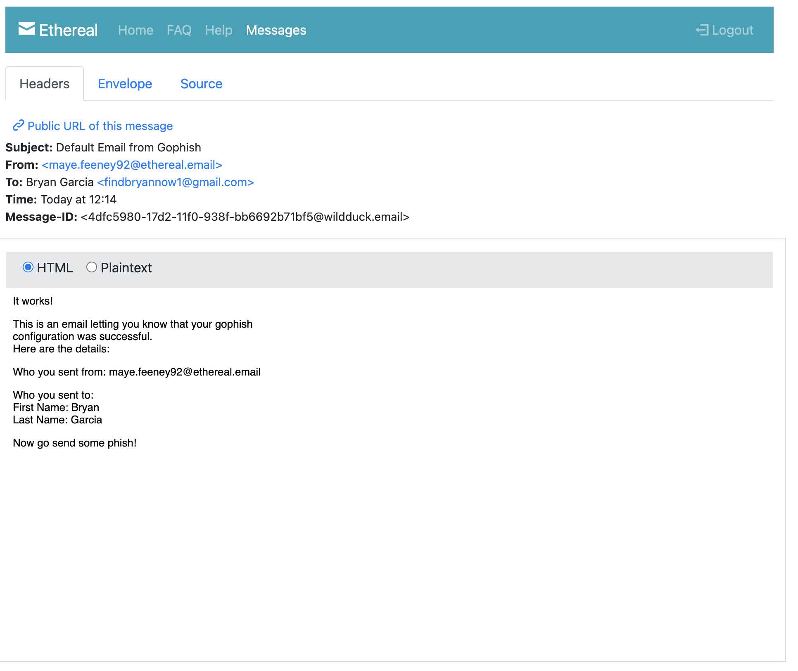
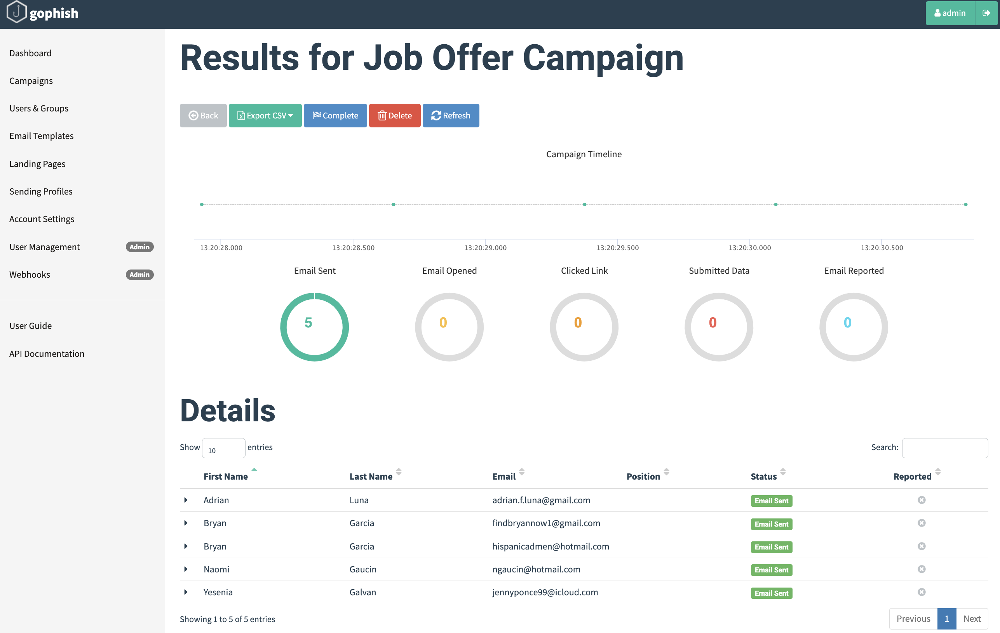
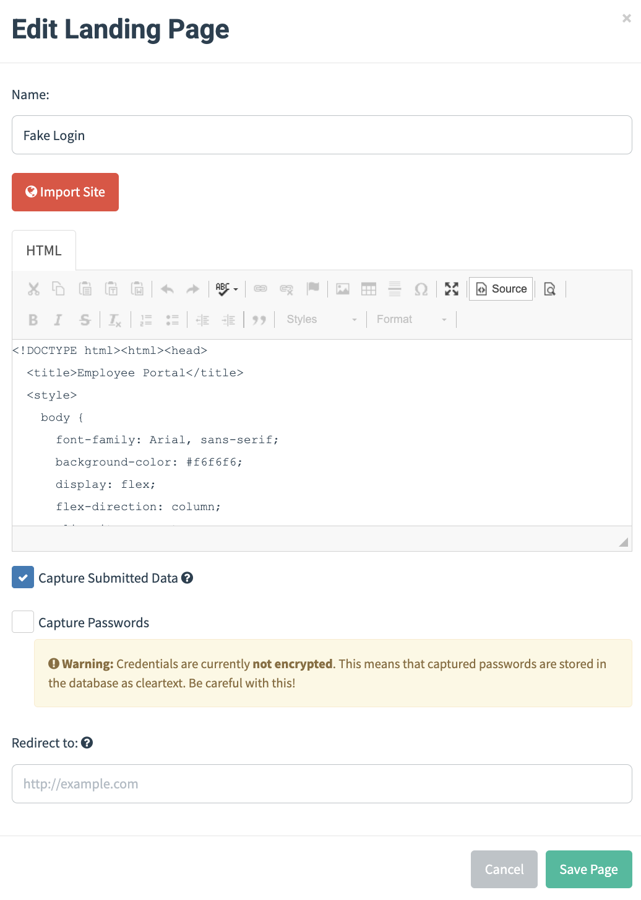

# 🛡️ Phishing Simulator Project

A lightweight phishing simulation lab designed to help cybersecurity learners test and understand phishing campaigns using **Gophish**, **Mailtrap**, and **Ethereal**.

---

## 🚀 Project Overview

This project simulates a phishing campaign in a safe, sandboxed environment using:

- **Gophish** to create and manage phishing campaigns
- **Mailtrap & Ethereal** for fake SMTP servers to test email delivery without spamming real inboxes

---

## 🛠️ Tech Stack

- Python / Flask (optional UI extension)
- Gophish (open-source phishing toolkit)
- Mailtrap (free SMTP testing)
- Ethereal (test inbox)
- GitHub CLI
- macOS Terminal

---

## 🔑 Key Features

- Create fake phishing email campaigns using Gophish  
- Securely test email delivery with Mailtrap and Ethereal  
- Learn hands-on how phishing works—without harming anyone  
- Professional README and GitHub push for recruiters  

---

### 📸 Screenshots

1. **Campaign Dashboard**  
   

2. **Email Template**  
   

3. **Ethereal Inbox**  
   

4. **Campaign Details**  
   

5. **Fake Login Landing Page**  
   

---

## 🧠 How to Use

```bash
1. Launch Gophish
   ./gophish
2. Open in browser:
   https://127.0.0.1:3333
3. Create sending profile with Mailtrap or Ethereal
4. Launch campaign and monitor results

---

📂 Repository
https://github.com/ckideas1/phishing-simulator-project

---

✅ Project Status
Pushed to GitHub

Tested email send with both Mailtrap and Ethereal

Ready for portfolio + resume
